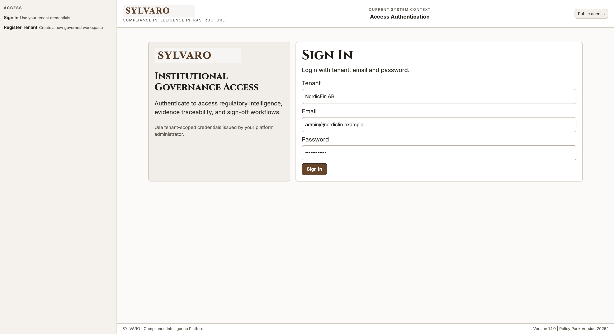
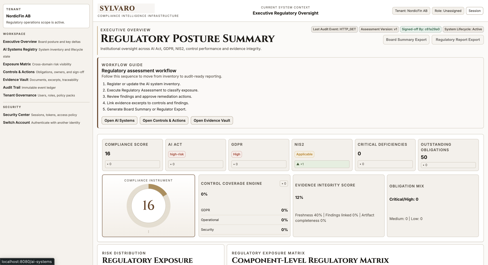
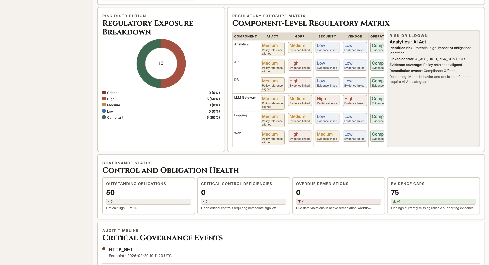
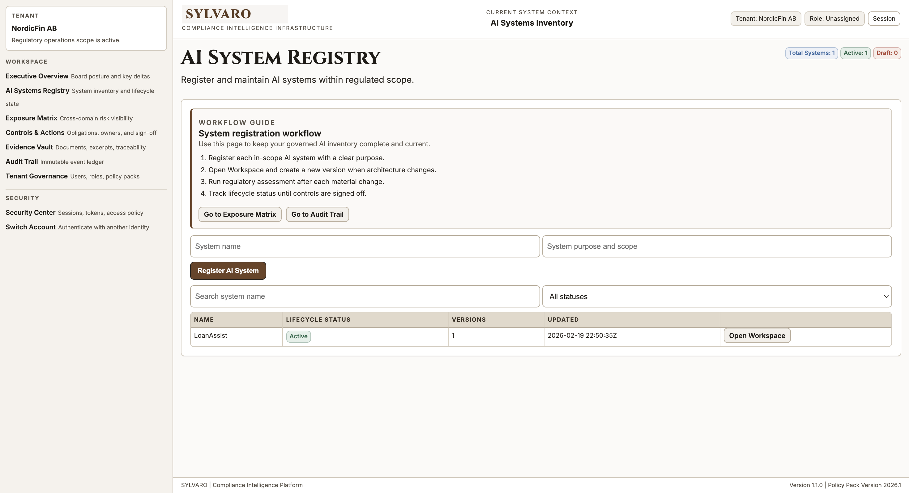
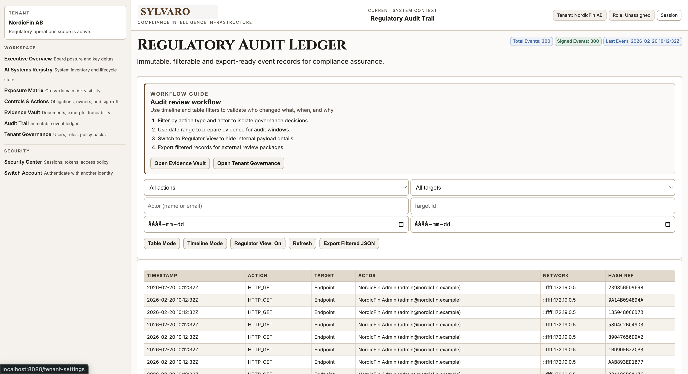
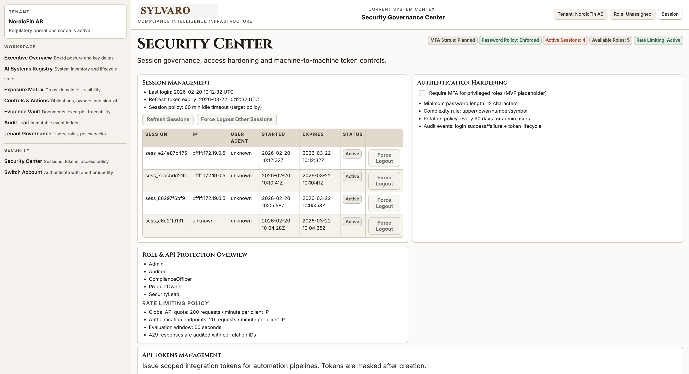

# 🛡️ SYLVARO

**Regulatory Intelligence Infrastructure**

Institutional compliance intelligence for AI Act, GDPR and NIS2 environments.

## Overview

SYLVARO is a governance infrastructure platform designed for regulated organizations operating AI systems within the EU.

It provides:

- Structured AI system inventory
- Regulatory exposure classification
- Control coverage tracking
- Evidence integrity monitoring
- Immutable audit ledger
- Executive-ready regulatory reporting

This is not a dashboard.  
It is a compliance operating system.

## Executive Regulatory Overview

Board-ready oversight across regulatory domains.

Includes:

- Compliance score instrument
- AI Act risk classification
- GDPR exposure level
- NIS2 applicability tracking
- Control Coverage Engine
- Evidence Integrity Score
- Component-Level Regulatory Matrix
- Governance timeline

## AI System Registry

Structured inventory of all governed AI systems.

Features:

- Lifecycle tracking (Draft / Active)
- Versioning
- Scope documentation
- Direct linkage to exposure matrix
- Workflow guidance for regulatory completeness

## Regulatory Exposure Matrix

Cross-domain regulatory risk visualization.

Capabilities:

- Component-level exposure classification
- AI Act / GDPR / Security / Vendor mapping
- Drilldown risk explanation panel
- Linked controls and remediation owners

## Regulatory Audit Ledger

Immutable, filterable and export-ready audit event ledger.

Designed for:

- Regulatory inspections
- Internal audit validation
- Governance traceability
- Evidence window reconstruction

Includes:

- Timeline mode
- Table mode
- Actor filtering
- Hash reference tracking

## Security Governance Center

Session management, token lifecycle and authentication hardening.

Features:

- Active session control
- Token management
- MFA readiness
- Password policy enforcement
- Rate limiting configuration
- Role & API protection overview

## Core Engines

### Control Coverage Engine

Calculates:

`Coverage % = Controls with Valid Evidence / Total Required Controls`

Domain-level breakdown:

- GDPR
- Security
- Operational
- Vendor

### Evidence Integrity Score

Weighted score based on:

- Evidence freshness
- Linked findings
- Artifact completeness
- Orphan controls

Provides measurable documentation quality.

### Governance Timeline

Chronological event stream of:

- Assessments
- Risk reclassifications
- Control sign-offs
- Evidence uploads
- System changes

## Architecture (High Level)

```text
Web UI (Razor / MVC)
        ↓
Application Layer (Regulatory Engines)
        ↓
Domain Models
        ↓
Persistence (SQL)
        ↓
Audit Event Store
```

Designed around:

- Domain-driven separation
- DTO mapping boundaries
- Structured logging
- Correlation IDs
- Fallback resilience

## Technology Stack

- .NET
- ASP.NET Core
- Razor Views
- SQL Database
- Structured Logging
- REST APIs

## Design Philosophy

SYLVARO is built around:

- Institutional clarity
- Regulatory defensibility
- Audit traceability
- Deterministic control logic
- Minimal but authoritative interface design

No neon dashboards.  
No marketing fluff.  
Just governance infrastructure.

## Product Screens

### Access Authentication



### Executive Regulatory Overview





### AI System Registry



### Regulatory Audit Ledger



### Security Governance Center



## Run SYLVARO

```bash
cp .env.example .env
docker compose up --build
```

After startup:

- Web UI: [http://localhost:8080](http://localhost:8080)
- API Swagger: [http://localhost:8081/swagger](http://localhost:8081/swagger)

Demo credentials:

- Tenant: `NordicFin AB`
- Email: `admin@nordicfin.example`
- Password: `ChangeMe123!`

## Roadmap

Planned enhancements:

- AI Risk Simulator
- Board-ready PDF export engine
- Control gap remediation workflow automation
- Evidence aging alerts
- Multi-tenant compliance benchmarking
- Policy pack version management

## Why SYLVARO?

Most compliance tools track documents.  
SYLVARO tracks regulatory posture.

Most dashboards show metrics.  
SYLVARO shows defensibility.

## Status

- Early-stage institutional prototype
- Enterprise architecture direction
- Governance-first design

## License

Private — Internal / Development use only.
